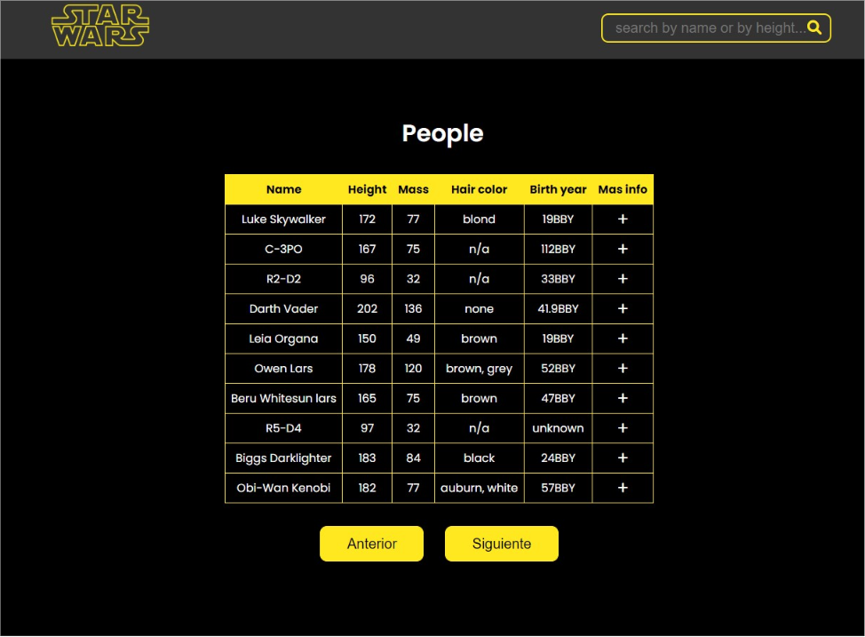

<h1>Aplicacion que muestra los datos de los personajes de Star Wars</h1>

<h2>Descripcion</h2>
Esta Aplicación está conformada por una tabla en donde muestra el nombre y cuatro características de cada personaje de Star Wars además en cada fila cuenta con una sección de más información que por medio de un signo de "+" se abre un modal con más información del personaje.
La tabla muestra una lista de 10 personajes y cuenta con dos botones de anterior y siguiente para mirar más personajes, el número total de personajes son 82,
En la parte del header hay un buscador que filtra los personajes por el nombre y la altura.

<h2>Instalar y Correr la aplicación</h2>
1. En la carpeta raiz de la aplicacion correr: npm install
 
2. La aplicación está compuesta con una instalación básica de Create-React-App todo está configurado para correr con un solo comando

<b>npm run dev</b>

La aplicacion se encuentra en: http://localhost:3000/ y se ve de la siguiente forma:

